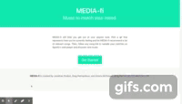

# Media-fi

## Our Task
Being able to use Third Party API’s to coexist and build each other is a fundamental part in coding different applications. Through this project, we aimed to build a functional and fun application that showcased this ability to use multiple API’s to create a dynamic application.

## User Story
As a user I am bored of the same playlist.
I want an app with random giph’s that represent 9 emotions.
When I click on a giphy, then a reloaded page of music recommendations will be displayed. Once I select my favorite song it takes me to Spotify and plays the selected song.

## Technologies Used
We used a plethora of technologies throughout this project. That list includes: Bulma, Javascript, HTML5, CSS3, jQuery, Giphy API, Spotify API, Node.js, Heroku, Github, Powerpoint, Slack, Zoom.

## Screenshot
[Screencast](https://youtu.be/goQVU4J506Y)

## Link to Deployed Site and Github Repository
https://polar-atoll-49785.herokuapp.com/index.html
https://github.com/Devil0341/Media-fi
